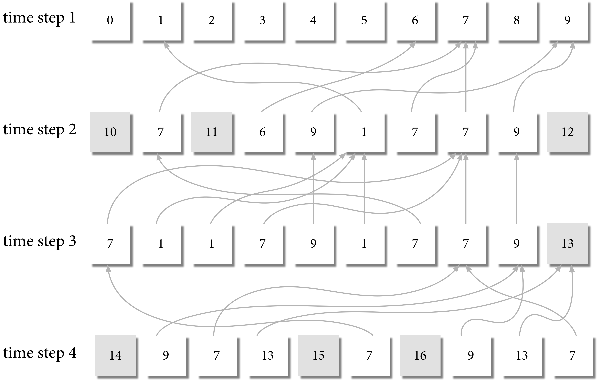

# Pevo

Implementations of various models of Cultural Evolution in Python. For now the packages implements the following models:

- Neutral Model of evolution (`models.NeutralModel`);
- Conformist Model of Evolution (`models.ConformistModel`);
- Anti-Conformist Model of Evolution (`models.AntiConformistModel`);
- Attraction Model of Evolution (`models.AttractionModel`);
- Exemplar Model of Evolution (`models.ExemplarModel`).

More info soon.

